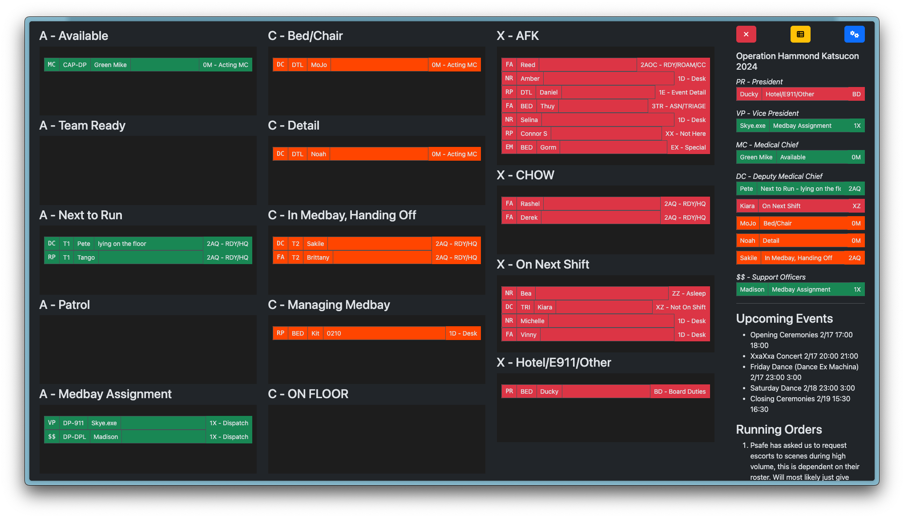
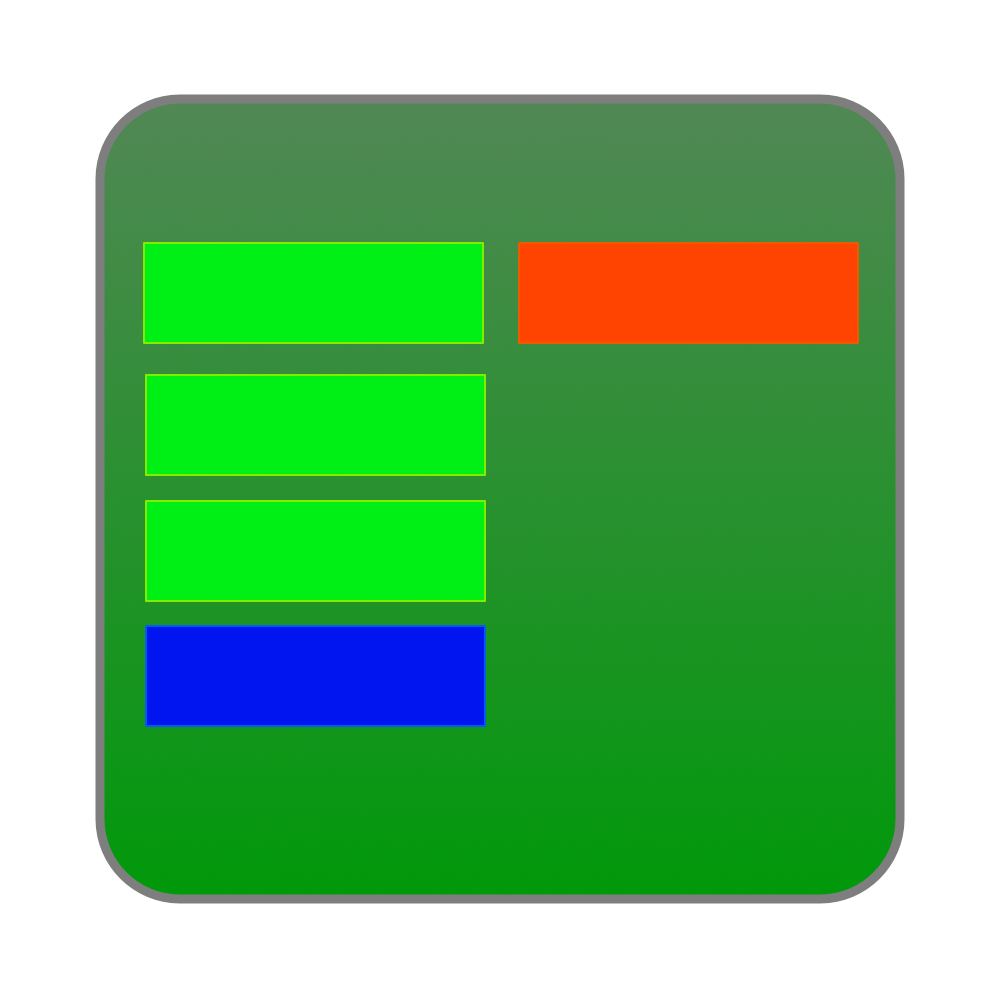

<p align="center"></p>
<h1 align="center">rosterboard</h1>
<p align="center">A management board and system for mobile teams.</p>
<p align="center"><a href="https://rosterboard.app">rosterboard.app</a> | <a href="https://docs.rosterboard.app">docs.rosterboard.app</a></p>

## Features
* Fully web-based, no operating system requirements
* WYSIWYG-style Drag-and-drop Team Management for Ease of Use
* Bulk Actions Editor (Pressing ESC or Tilde)
* Uses modern HTML and Services
* Multiple people can view and edit the same board (Multiplayer via Websockets, no additional server needed)
* Built-in Timekeeping between on and off shift users
* "High Volume" mode to group members together into fireteams
* Highlight specific high-value roles in the sidebar to keep track of VIPs
* Kiosk URLs and free-badge association to allow users to manage their own status (With permissive restrictions if necessary)
* Role,Rank,Duty categorizations to allow admins and managers to see at-a-glance what qualifications a member has
* Notes field for bespoke notes per-user
* Multi-tenant, to allow one application to manage multiple events.

## Demo
https://live.rosterboard.app

## Requirements
* Docker (If using Docker Setup)
* Python 3.12.x
* PostgreSQL 16 or newer
* Redis 7 or newer

## Getting Started

### Using Docker
```bash
docker volume create rosterboard-data
docker run -v rosterboard-data:/app/config -p 8080:8080 --restart=unless-stopped --name rosterboard -d jouleworks/rosterboard:v1.2
```

### Using Docker Compose
```bash
curl -O https://raw.githubusercontent.com/Jouleworks/rosterboard/refs/heads/main/docker/production/docker-compose.yaml
curl -O .env https://raw.githubusercontent.com/Jouleworks/rosterboard/refs/heads/main/docker/production/.env.example # optional!
docker compose up -d 
```

### From Source
```bash
git clone git@github.com:Jouleworks/rosterboard.git
python -m venv .venv
source .venv/bin/activate
pip install -r requirements.txt
bash entrypoint.sh
```

Go to http://localhost:8080/setup/ to begin.

# Environment Variables

Set these variables during initial config setup to override default container values. All variables have default values and are not required.

| Variable Name     | Description                              | Default            |
|-------------------|------------------------------------------|--------------------|
| POSTGRES_HOST     | Hostname for Postgres Database           | `rosterboard`      |
| POSTGRES_PORT     | Port for Postgres Database               | 5432               |
| POSTGRES_USER     | User for the Postgres Database.          | `rosterboard`      |
| POSTGRES_PASSWORD | Password for the Postgres Database.      | `rosterboard`      |
| POSTGRES_DB       | Database name for the Postgres Database. | `rosterboard`      |
| REDIS_HOST        | Host for the Redis Server                | `rosterboard-redis` |


## Upgrading

### Using Docker
```bash
docker stop rosterboard
docker pull jouleworks/rosterboard:v1.2 # Replace v1.2 with the tag you want to upgrade to here. https://hub.docker.com/r/jouleworks/rosterboard/tags
docker start rosterboard
```

### Using Docker Compose
```bash
docker compose up -d
```

### From Source
```bash
git pull origin main
bash entrypoint.sh
```
